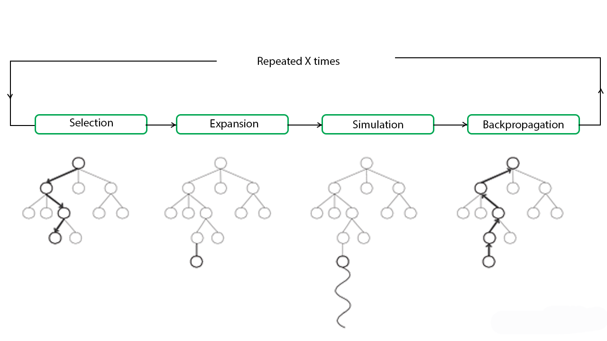
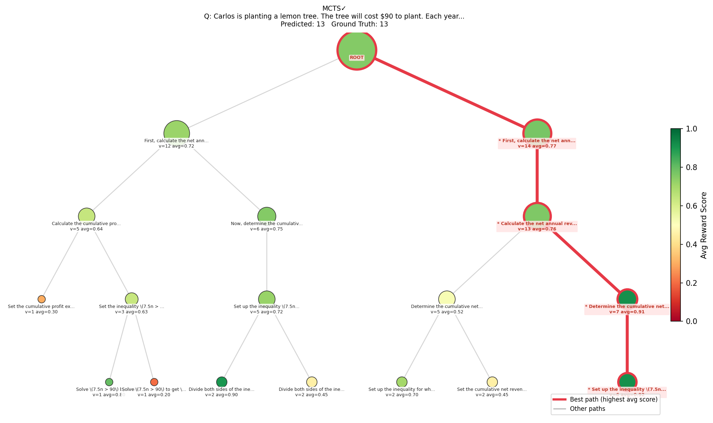

# MCTS for LLM Reasoning

A hands-on exploration of reasoning strategies for language models, from simple Chain-of-Thought to Monte Carlo Tree Search (MCTS). Evaluated on the GSM8K math benchmark.

---

## Overview

Standard LLMs often struggle with multi-step reasoning because they commit to a single answer path without the ability to backtrack or explore alternatives. This notebook compares four reasoning methods — ranging from a basic one-shot approach to a tree-based search strategy — and analyzes their trade-offs in accuracy, token usage, and latency.

---

## Dataset

**GSM8K** — a benchmark of ~8,500 grade school math problems requiring multi-step reasoning.  
The notebook samples 20 problems from the test split for evaluation.

---

## Methods Compared

### 1. Direct Answer (Baseline)
The model answers immediately without any reasoning steps. Serves as the lower-bound baseline.

### 2. Chain-of-Thought (CoT)
The model reasons step by step before providing a final answer. Significantly improves accuracy over direct answering but is limited to a single reasoning path with no backtracking.

### 3. Self-Consistency
Runs CoT multiple times (3 votes) in parallel and takes the majority answer. More robust to random errors, but cannot recover from systematic mistakes shared across all runs.

### 4. Best-of-N
Generates N independent reasoning paths, scores each using a verifier prompt, and selects the highest-scoring one. Useful when answers diverge, but susceptible to the model over-scoring confident-sounding wrong answers.

### 5. MCTS (Monte Carlo Tree Search)
Builds a reasoning tree by iteratively selecting, expanding, simulating (rollout), and backpropagating scores — the same core loop used in AlphaGo. Each node represents a partial reasoning step; UCB1 balances exploring new paths versus deepening promising ones.

**MCTS loop:**
| Step | Description |
|------|-------------|
| Selection | Follow UCB1 scores to the most promising leaf |
| Expansion | Generate k distinct next reasoning steps via LLM |
| Rollout | Complete the solution from the current partial state |
| Backpropagation | Update visit counts and values up the tree |


---
**Example search tree** (node size = visit count, color = avg reward score):




## Evaluation Metrics

Since MCTS uses significantly more LLM calls, raw accuracy alone is not a fair comparison. The notebook reports:

- **Accuracy** — % of questions answered correctly
- **Avg tokens** — total API tokens consumed per question
- **Avg latency** — wall-clock time per question (seconds)
- **Tokens per correct answer** — efficiency metric

---

## Requirements

```
datasets
litellm
matplotlib
nest_asyncio
numpy
```

Install with:
```bash
pip install datasets litellm matplotlib nest_asyncio
```

---

## Setup

Set your API key as an environment variable before running:

```bash
export API_KEY=your_key_here
```

## Usage

Open `MCTS_LLM.ipynb` in Jupyter and run cells sequentially. Key parameters you can adjust:

| Parameter | Default | Effect |
|-----------|---------|--------|
| `num_examples` | 20 | Number of GSM8K problems to evaluate |
| `n_votes` | 3 | Votes for Self-Consistency |
| `n` | 3 | Candidates for Best-of-N |
| `iterations` | 20 | MCTS search iterations per problem |
| `k` | 2 | Branches expanded per MCTS node |
| `max_depth` | 4 | Maximum tree depth |

> Increasing `iterations` and `k` generally improves MCTS accuracy at the cost of more tokens.

---

## Visualizations

The notebook includes:
- MCTS search tree visualization (node size = visit count, color = reward score)
- Evaluator score distribution histogram
- Token-normalized comparison across all methods

---

## Notes

- All methods share the same total token budget per question for a fair comparison.
- The MCTS evaluator scores reasoning quality (0.0–1.0) based on logical consistency and arithmetic correctness, without knowing the ground truth answer.
- This notebook is intended as an educational demonstration. Results may vary with different models, sample sizes, or hyperparameters.
